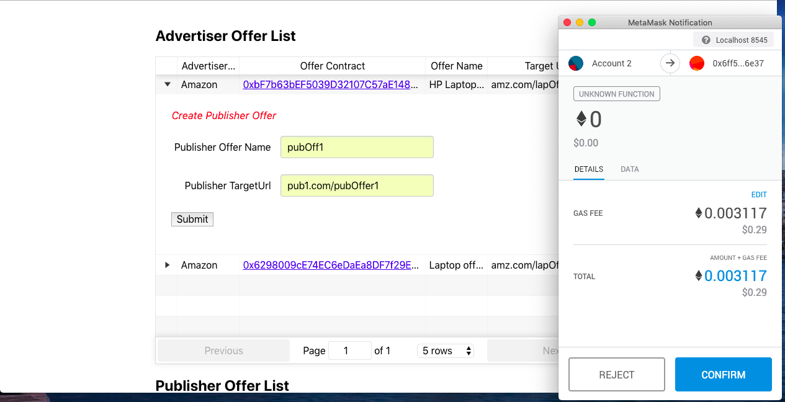

# Ad-Chain

## What is it?

Affiliation based advertisement is approximately a **$8 billion** industry and using **Ad-Chain**, we now have the ability to make better, faster and smoother for everyone involved with it. Using Ad-Chain we bring transparency, less hassle, on time payment and satisfaction to this process and make it smooth.

## How does it help us?

* Miscommunication and lack of transparency and information between **Affiliators** and **Sellers** affects **cash flow** in the system.
* Long verification process for user transactions. It might take **90 days** to **120 days**.
* Huge **commissions** taken by **middle men**.
* Payment delays which may be upto **3 months**.

## How does it work?

Advertiser join the network and create a **Smart Contract** for an offer. Offer details are stored in IPFS with HASH of offer data in the contract as a transaction Publishers join the network and browse available offers from Advertisers and accept offers and join the Smart Contract. Each Smart Contract will have a set of Publishers who accepted T&C of the offer. Publisher place the offers on their website. Consumers go to the publisher website and click on the offer. **Click is tracked** as transaction in the Smart Contract with detail data stored in IPFS and consumer is redirected to offer URL. Consumer completes the required action at the redirected Advertiser offer URL. Advertiser confirms the offer conversion as a transaction on the Smart Contract and store the conversion data in the **IPFS**.

**Step by step working can also be seen [here](docs/Ad-Chain-Working.pdf)**.

## Setup

 * Node should be installed

```
node -v
v10.13.0
```

* truffle should be installed

  **npm install -g truffle**

## Deploy Contracts to Local Blockchain

### Steps:

* Start Ganache Server

* Add/Modify network configuration : truffle.js as per your local and Test setting
    https://truffleframework.com/docs/truffle/reference/configuration#networks

* Change as per ganache running port inside client -> utils -> getWeb3.js (For me line 23 : Port 8545)

* Compile:

  **truffle compile**

```
Compiling ./contracts/Advertiser.sol...
Compiling ./contracts/Publisher.sol...
Writing artifacts to ./client/src/contracts

```

* Migrate Contract to Ganache

  **truffle migrate or truffle migrate --reset**

```
truffle migrate --reset
Using network 'development'.

Running migration: 1_initial_migration.js
  Replacing Migrations...
  ... 0x03c8940b3fe9bf3956ea067b995d7e9cf7cb89ff9124d4c416fc598f5067229a
  Migrations: 0xc7aacf4a1ae41a3988ae7acd52bf772a5c94285d
Saving successful migration to network...
  ... 0x43507196c690c0f359c402c2830460bfda0f6c7e56f07655bed416f2e9663eba
Saving artifacts...
Running migration: 2_deploy_contracts.js
  Replacing AdvertiserFactory...
  ... 0xea6b5e2eedad908d7a0466010acebc134ded79fddf4d49cf8ab4359e2dd9b580
  AdvertiserFactory: 0xf7a942c4143d68c35f8ba75ef447eb06c2ff63aa
  Replacing PublisherFactory...
  ... 0xcfd1c0e10c0b95d93de18563c5676a4fd7e6708283b85a415c88561cb5c27f43
  PublisherFactory: 0xbea049b2084b8247383fd8c292a8601cc22fe99f
Saving successful migration to network...
  ... 0x5ac018dcfb58dd25d39aba9a42efb01304750b1485f70466de44ea39576a53de
Saving artifacts...

```

* Test Using Local Frontend
Go inside "client" folder

  **npm run start**


* Create frontend build for production.
Go inside "client" folder

  **npm run build**

```
Creating an optimized production build...
Compiled with warnings.

File sizes after gzip:

  416.65 KB  build/static/js/1.500508f5.chunk.js
  112.27 KB  build/static/js/main.af02dad2.chunk.js
  4 KB       build/static/css/main.ae258b2e.chunk.css
  1.61 KB    build/static/css/1.b00b63d5.chunk.css
  763 B      build/static/js/runtime~main.229c360f.js

The project was built assuming it is hosted at the server root.
You can control this with the homepage field in your package.json.
For example, add this to build it for GitHub Pages:

  "homepage" : "http://myname.github.io/myapp",

The build folder is ready to be deployed.
You may serve it with a static server:

  yarn global add serve
  serve -s build

Find out more about deployment here:

  http://bit.ly/CRA-deploy

```

## Flow

### Advertiser creation and Offer creation

```
Go to localhost:3000/advertiser
```

* Advertiser Signup

```
Create a profile for advertiser using MetaMask.
```


* Offer Creation
```
Create an offer with filling up needed information.
```


### Publisher creation and Offer registration

```
Go to localhost:3000/publisher
```

* Publisher Signup

```
Create a profile for publisher using MetaMask preferably different account
from advertisers just for simplicity sake.
```


* Offer Registration
```
Register to an existing offer listed out in the all offers sections,
where there will be a collection of offers from all the advertisers.
```




### Click Generation
```
Ideally this click generation has to be organised from Publisher Back-end,
but for time being and easy demo, we are creating it from the publisher page.
Just fill in the details and submit the form.
```


### Conversion Generation
```
Ideally this too has to be done from Advertiser Back-end which for the
time being we skipped. Here you will provide the UI with Publisher Contract Address
and Click Id which you just generated in the previous step and there you go
with the conversion.
```


